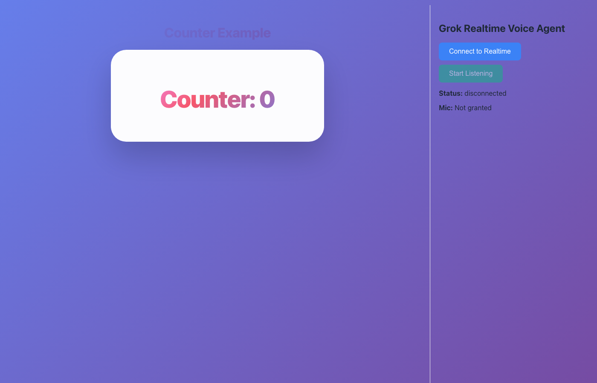
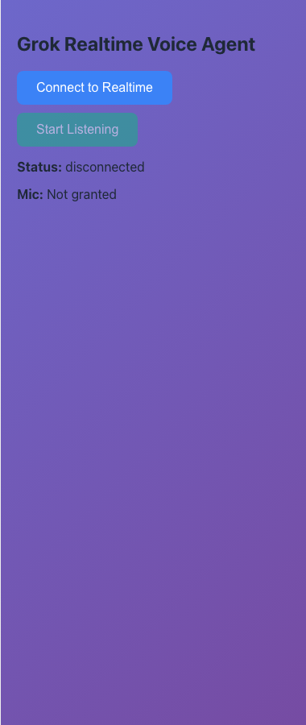
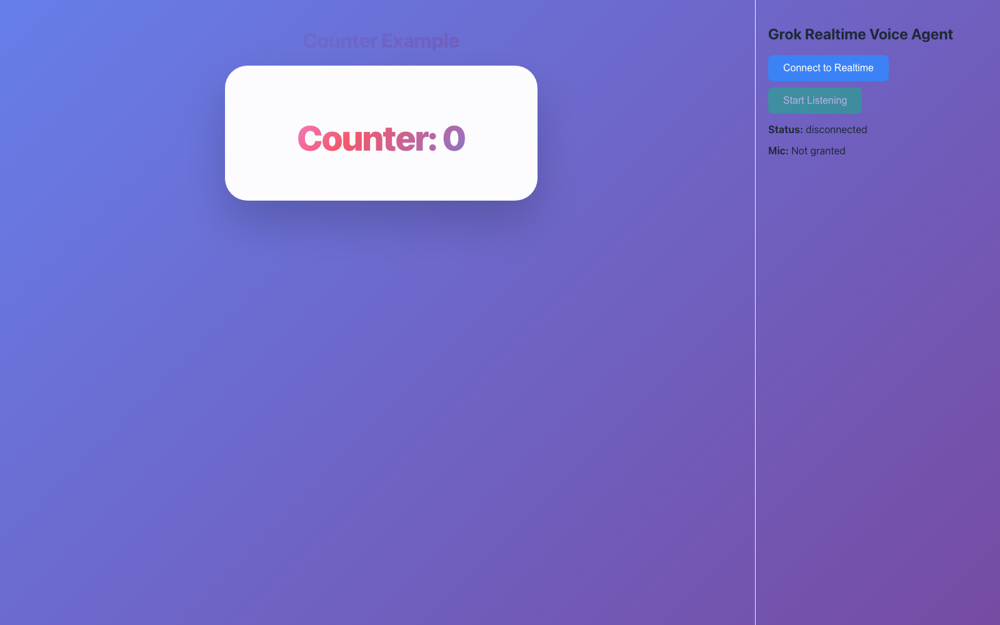

# x-Skills for AI: Realtime Voice-Controlled App Example

[](https://www.npmjs.com/package/@x-skills-for-ai/react) [](https://x.ai)

Fullstack React + Node.js application demonstrating [@x-skills-for-ai/react](https://www.npmjs.com/package/@x-skills-for-ai/react) integration with **realtime voice AI** powered by [xAI Grok Realtime API](https://docs.x.ai/docs/realtime).

## 🚀 Features

- **Voice-Controlled App Switching**: Say \"switch to counter\" or \"open todo\" to navigate apps using skills.
- **Realtime Voice Chat**: Full-duplex voice conversation with Grok (voice: Ara).
- **Dynamic Skill Tool Calling**: Grok automatically detects and calls frontend skills via `execute_skill` tool.
- **Skills**:
  | ID | Description | Params |
  |----|-------------|--------|
  | `switch_app` | Switch between counter and todo apps | `{ tab: \"counter\" \| \"todo\" }` |
- **Text Chat Fallback**: `/api/chat` endpoint for non-voice interaction.
- **Skills Runtime Sync**: Frontend skills auto-discovered and sent to backend for Grok context.
- **Audio Processing**: Browser-based speech detection and PCM encoding.
- **Production-Ready**: Socket.io for reliable frontend-backend comms, WebSocket proxy to xAI.

## 📁 Project Structure

```
.
├── backend/                 # Express + Socket.io + xAI Realtime
│   ├── server.js           # Main server, xAI WS proxy, tool handling
│   ├── package.json        # Dependencies: openai, socket.io, ws
│   └── .env.example        # XAI_API_KEY required
├── frontend/               # React + Vite + TS
│   ├── src/
│   │   ├── App.tsx         # App switcher + useXSkill
│   │   ├── Counter.tsx     # Counter component
│   │   ├── Todo.tsx        # Todo app
│   │   ├── chat/
│   │   │   └── Realtime.tsx # Voice UI + Socket.io client
│   │   └── audio-processor-worklet.js # Mic input processing
│   ├── package.json        # @x-skills-for-ai/react, socket.io-client
│   └── vite.config.mts
├── README.md
└── deploy/                 # Frontend build artifacts
```

## 📸 Screenshots

### Counter View (Default Landing Page)


### Grok Realtime Voice Agent Panel


### Full App Overview


## ⚡ Quick Start

### 1. Backend (Realtime Voice Server)

```bash
cd backend
cp .env.example .env
# Add your xAI API key: XAI_API_KEY=sk-...
npm install
npm run dev
```

✅ Server ready: `http://localhost:3001`

### 2. Frontend (React App)

New terminal:

```bash
cd frontend
npm install
npm run dev
```

✅ App ready: `http://localhost:5173`

**Usage**:
- Click **mic button** in chat sidebar → Speak commands like \"switch to todo app\".
- Grok will call `switch_app` skill → App switches instantly.
- Casual chat works too: \"Hello!\" → Normal voice response.

## 🔧 Backend APIs

| Endpoint | Method | Description |
|----------|--------|-------------|
| `/api/chat` | POST `{ message: string, skills?: [] }` | Text chat with skill JSON responses. |
| `/api/realtime-token` | GET | Temp token for direct xAI WS (internal). |

**Example Chat**:
```bash
curl -X POST http://localhost:3001/api/chat \
  -H "Content-Type: application/json" \
  -d '{"message": "switch to counter", "skills": [{"id":"switch_app", "description":"..."}]}'
```

## 🏗️ Architecture

```
Browser Mic → Frontend (Worklet + Socket.io) → Backend (Socket.io)
                                                           ↓
                                                      xAI Realtime WS
                                                           ↓
Tool Call (execute_skill) → Frontend Skill → Result → xAI → Voice Response
```

1. Frontend registers skills with [`useXSkill`](https://www.npmjs.com/package/@x-skills-for-ai/react).
2. Skills list sent to backend on connect.
3. Backend creates xAI session with `execute_skill` tool.
4. Voice → xAI detects tool → Forwards to frontend → Executes → Returns result.
5. xAI generates voice response streamed back.

## 🔑 Environment Variables

**.env** (backend):
```
XAI_API_KEY=sk-...  # From https://console.x.ai
```

## 🧪 Testing Skills

- Voice: \"Increment the counter\" (if extended).
- Extend: Add `useXSkill({ id: \"increment\", handler: ... })` in components.

## 🚀 Deployment

### Frontend (Static)
```bash
cd frontend
npm run build
npm run deploy  # gh-pages
```

### Backend
- [Railway](https://railway.app), [Render](https://render.com), [Fly.io](https://fly.io), or VPS.
- Set `XAI_API_KEY` env var.
- Update frontend Socket.io URL if needed.

## 📚 Resources

- [@x-skills-for-ai/react](https://www.npmjs.com/package/@x-skills-for-ai/react)
- [xAI Realtime API Docs](https://docs.x.ai/docs/realtime)
- [Socket.io](https://socket.io)
- Frontend mic: [Web Audio API + Worklet](frontend/src/audio-processor-worklet.js)

## 🤝 Contributing

Fork → Changes → PR. Focus on new skills demos!

---

⭐ **Star on GitHub** if useful!
